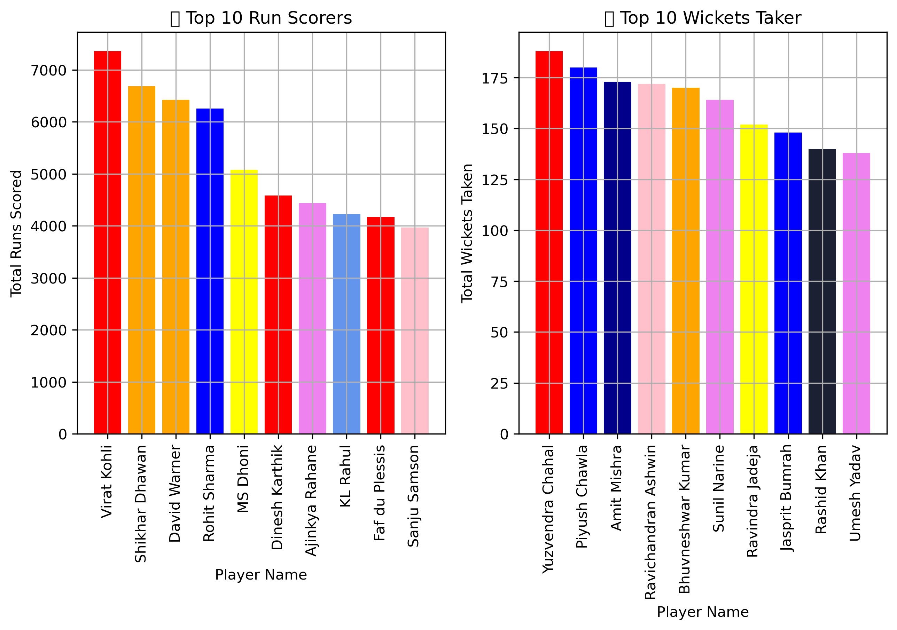

# 🏏 IPL Player Performance Analysis (2008–2024)

This project is an in-depth exploratory data analysis (EDA) of player performances in the Indian Premier League (IPL) across seasons. It focuses on uncovering trends and top players in batting, bowling, and fielding using Python libraries like Pandas, Matplotlib, and Seaborn.

---

## 📁 Dataset

The dataset contains IPL player statistics from 2008 to 2024 (based on available data). Each row represents a player's performance in a given season.  
**Columns include:** matches played, runs, strike rate, wickets, economy, catches, etc.

---

## 🚀 Key Analyses

- 🏏 Top batsmen by runs, strike rate, and consistency
- 🎯 Leading wicket-takers and best economy bowlers
- 🧤 Most catches and stumpings (fielding impact)
- 📈 Trends over the years — MS Dhoni, Virat Kholi, Rohit Sharma

---

## 📊 Tools Used

- Python 🐍
- Pandas 🐼
- Matplotlib 📉
- Jupyter Notebook

---

## 📸 Sample Visuals

  
*Sample: Top 10 IPL Run Scorers of All Time*

---

## 🧠 Insights

- Virat Kohli dominates as the highest run scorer in IPL history.
- Rashid Khan holds the best economy across bowlers with 50+ matches.
- Dhoni continues to contribute significantly behind the stumps and with the bat.
- Several rising all-rounders show promise in both batting and bowling.

---

